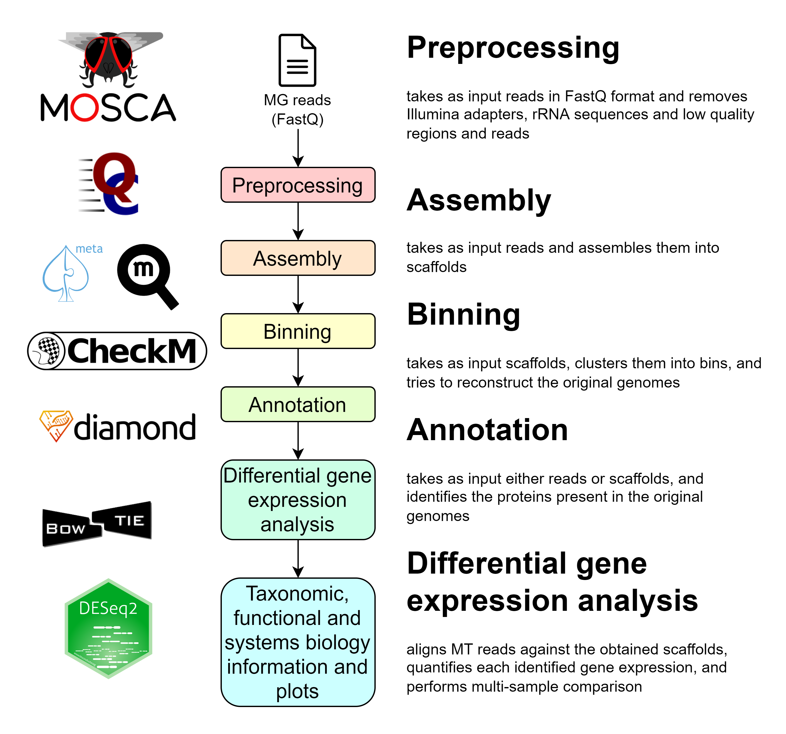

### Hi there! 👋

I am a PhD student, using bioinformatics to "Uncover the role of conductive nanomaterials in anaerobic digestion".

### Tools for meta-omics analyses

My work has mostly been the development of tools for analyses of meta-omics data, i.e., the study of the collective genomes, transcriptomes or proteomes of a microbial community.

These are the main tools I have developed for meta-omics analyses:

#### UPIMAPI, reCOGnizer and KEGGCharter

[UPIMAPI](https://github.com/iquasere/UPIMAPI), [reCOGnizer](https://github.com/iquasere/reCOGnizer) and [KEGGCharter](https://github.com/iquasere/KEGGCharter) are tools developed for the analyses of omics data, and optimized for handling the challenges of meta-omics.

<p align="center">
    
</p>

#### MOSCA

[MOSCA](https://github.com/iquasere/MOSCA) is a powerful pipeline developed for metagenomics (MG), metatranscriptomics (MT) and metaproteomics (MP) integrated analyses.

<p align="center">
    
</p>


#### Finally, some metrics about my coding routine:

<!--START_SECTION:waka-->


**I'm an Early 🐤** 

```text
🌞 Morning    157 commits    ███████░░░░░░░░░░░░░░░░░░   29.85% 
🌆 Daytime    299 commits    ██████████████░░░░░░░░░░░   56.84% 
🌃 Evening    66 commits     ███░░░░░░░░░░░░░░░░░░░░░░   12.55% 
🌙 Night      4 commits      ░░░░░░░░░░░░░░░░░░░░░░░░░   0.76%

```
📅 **I'm Most Productive on Tuesday** 

```text
Monday       117 commits    █████░░░░░░░░░░░░░░░░░░░░   22.24% 
Tuesday      154 commits    ███████░░░░░░░░░░░░░░░░░░   29.28% 
Wednesday    84 commits     ████░░░░░░░░░░░░░░░░░░░░░   15.97% 
Thursday     80 commits     ███░░░░░░░░░░░░░░░░░░░░░░   15.21% 
Friday       83 commits     ████░░░░░░░░░░░░░░░░░░░░░   15.78% 
Saturday     4 commits      ░░░░░░░░░░░░░░░░░░░░░░░░░   0.76% 
Sunday       4 commits      ░░░░░░░░░░░░░░░░░░░░░░░░░   0.76%

```


📊 **This Week I Spent My Time On** 

```text
💬 Programming Languages: 
Text                     1 hr 44 mins        ██████████████░░░░░░░░░░░   57.96% 
C++                      28 mins             ████░░░░░░░░░░░░░░░░░░░░░   15.89% 
Python                   23 mins             ███░░░░░░░░░░░░░░░░░░░░░░   12.87% 
Snakemake                13 mins             █░░░░░░░░░░░░░░░░░░░░░░░░   7.45% 
R                        8 mins              █░░░░░░░░░░░░░░░░░░░░░░░░   4.54%

🐱‍💻 Projects: 
NUFEB-dev                2 hrs 5 mins        █████████████████░░░░░░░░   69.54% 
MOSCA                    23 mins             ███░░░░░░░░░░░░░░░░░░░░░░   13.14% 
UPIMAPI                  13 mins             ██░░░░░░░░░░░░░░░░░░░░░░░   7.5% 
lammps                   10 mins             █░░░░░░░░░░░░░░░░░░░░░░░░   5.6% 
LightEditProject         7 mins              █░░░░░░░░░░░░░░░░░░░░░░░░   4.22%

```

**I Mostly Code in Python** 

```text
Python                   8 repos             ███████████░░░░░░░░░░░░░░   47.06% 
HTML                     4 repos             ██████░░░░░░░░░░░░░░░░░░░   23.53% 
Jupyter Notebook         2 repos             ███░░░░░░░░░░░░░░░░░░░░░░   11.76% 
Java                     1 repo              █░░░░░░░░░░░░░░░░░░░░░░░░   5.88% 
TeX                      1 repo              █░░░░░░░░░░░░░░░░░░░░░░░░   5.88%

```


 Last Updated on 30/11/2022 18:43:29 UTC
<!--END_SECTION:waka-->
