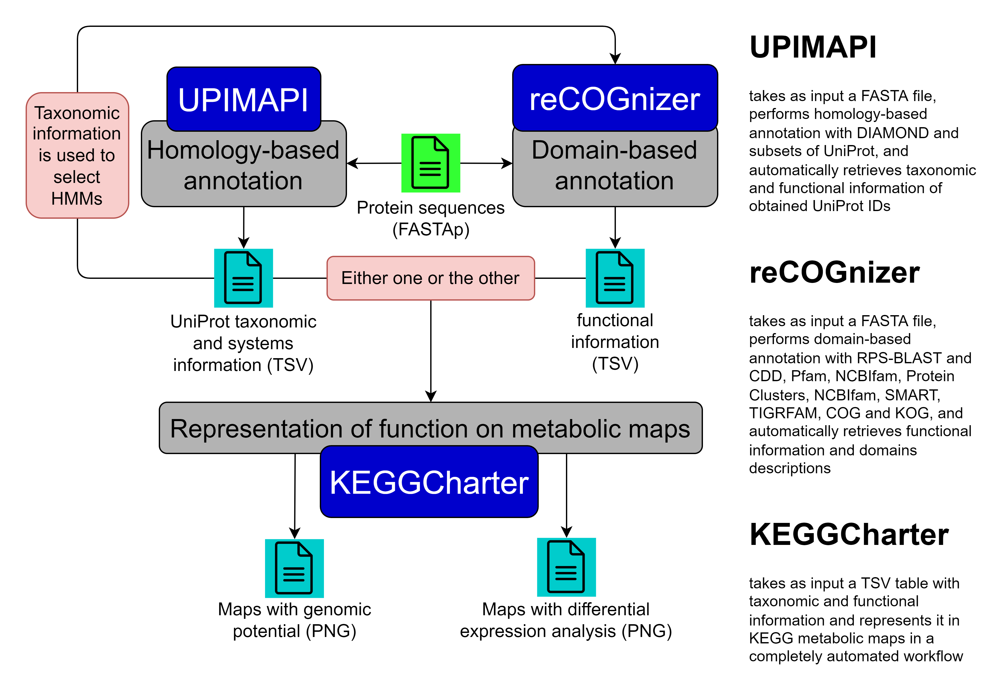

### Hi there 

I am a PhD student, using bioinformatics to "Uncover the role of conductive nanomaterials in anaerobic digestion".

### Tools for meta-omics analyses

My work has mostly been the development of tools for analyses of meta-omics data, i.e., the study of the collective genomes, transcriptomes or proteomes of a microbial community.

These are the main tools I have developed for meta-omics analyses:

#### UPIMAPI, reCOGnizer and KEGGCharter

[UPIMAPI](https://github.com/iquasere/UPIMAPI), [reCOGnizer](https://github.com/iquasere/reCOGnizer) and [KEGGCharter](https://github.com/iquasere/KEGGCharter) are tools developed for the analyses of omics data, and optimized for handling the challenges of meta-omics.

<p align="center">
    
</p>

#### MOSCA

[MOSCA](https://github.com/iquasere/MOSCA) is a powerful pipeline developed for metagenomics (MG), metatranscriptomics (MT) and metaproteomics (MP) integrated analyses.

<p align="center">
    
</p>


### Finally, some metrics about my coding routine:

<!--START_SECTION:waka-->
**I'm an Early 🐤** 

```text
🌞 Morning    163 commits    ████████░░░░░░░░░░░░░░░░░   34.39% 
🌆 Daytime    250 commits    █████████████░░░░░░░░░░░░   52.74% 
🌃 Evening    58 commits     ███░░░░░░░░░░░░░░░░░░░░░░   12.24% 
🌙 Night      3 commits      ░░░░░░░░░░░░░░░░░░░░░░░░░   0.63%

```
📅 **I'm Most Productive on Tuesday** 

```text
Monday       114 commits    ██████░░░░░░░░░░░░░░░░░░░   24.05% 
Tuesday      123 commits    ██████░░░░░░░░░░░░░░░░░░░   25.95% 
Wednesday    66 commits     ███░░░░░░░░░░░░░░░░░░░░░░   13.92% 
Thursday     71 commits     ███░░░░░░░░░░░░░░░░░░░░░░   14.98% 
Friday       90 commits     ████░░░░░░░░░░░░░░░░░░░░░   18.99% 
Saturday     4 commits      ░░░░░░░░░░░░░░░░░░░░░░░░░   0.84% 
Sunday       6 commits      ░░░░░░░░░░░░░░░░░░░░░░░░░   1.27%

```


📊 **This Week I Spent My Time On** 

```text
💬 Programming Languages: 
Snakemake                3 hrs 41 mins       █████████░░░░░░░░░░░░░░░░   36.87% 
Python                   3 hrs 17 mins       ████████░░░░░░░░░░░░░░░░░   32.86% 
Markdown                 2 hrs 50 mins       ███████░░░░░░░░░░░░░░░░░░   28.3% 
Text                     9 mins              ░░░░░░░░░░░░░░░░░░░░░░░░░   1.52% 
YAML                     2 mins              ░░░░░░░░░░░░░░░░░░░░░░░░░   0.34%

🐱‍💻 Projects: 
barcodes_benchmark       7 hrs 16 mins       ██████████████████░░░░░░░   72.52% 
annotation_paper         2 hrs 38 mins       ██████░░░░░░░░░░░░░░░░░░░   26.39% 
UPIMAPI                  6 mins              ░░░░░░░░░░░░░░░░░░░░░░░░░   1.09%

```

**I Mostly Code in Python** 

```text
Python                   8 repos             ███████████████░░░░░░░░░░   61.54% 
HTML                     2 repos             ███░░░░░░░░░░░░░░░░░░░░░░   15.38% 
Java                     1 repo              ██░░░░░░░░░░░░░░░░░░░░░░░   7.69% 
CSS                      1 repo              ██░░░░░░░░░░░░░░░░░░░░░░░   7.69% 
TeX                      1 repo              ██░░░░░░░░░░░░░░░░░░░░░░░   7.69%

```


 Last Updated on 28/01/2022 18:42:46 UTC
<!--END_SECTION:waka-->
