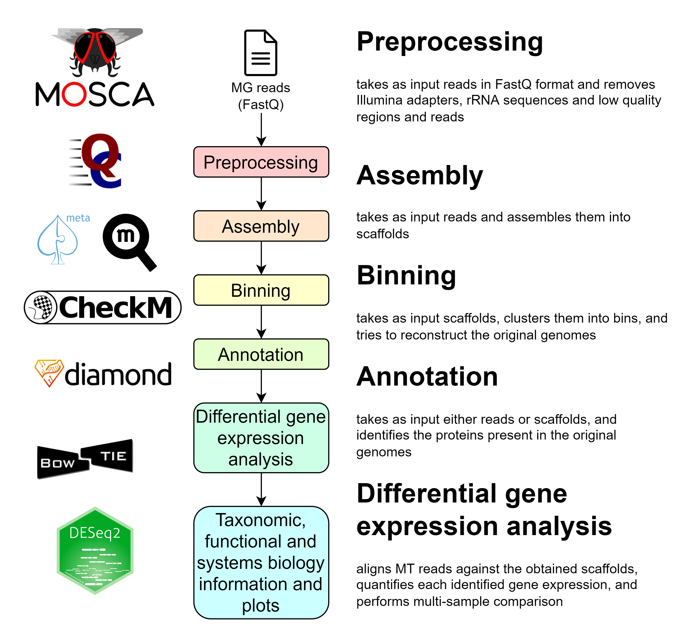

### Hi there! 👋

I was a PhD student, using bioinformatics to "Uncover the role of conductive nanomaterials in anaerobic digestion".

### Tools for meta-omics analyses

My work has mostly been the development of tools for analyses of meta-omics data, i.e., the study of the collective genomes, transcriptomes or proteomes of a microbial community.

These are the main tools I have developed for meta-omics analyses:

#### UPIMAPI, reCOGnizer and KEGGCharter

[UPIMAPI](https://github.com/iquasere/UPIMAPI), [reCOGnizer](https://github.com/iquasere/reCOGnizer) and [KEGGCharter](https://github.com/iquasere/KEGGCharter) are tools developed for the analyses of omics data, and optimized for handling the challenges of meta-omics.

<p align="center">
    
</p>

#### MOSCA

[MOSCA](https://github.com/iquasere/MOSCA) is a powerful pipeline developed for metagenomics (MG), metatranscriptomics (MT) and metaproteomics (MP) integrated analyses.

<p align="center">
    
</p>


#### Finally, some metrics about my coding routine:

<!--START_SECTION:waka-->


**I'm an Early 🐤** 

```text
🌞 Morning                1206 commits        ██████░░░░░░░░░░░░░░░░░░░   22.53 % 
🌆 Daytime                2785 commits        █████████████░░░░░░░░░░░░   52.04 % 
🌃 Evening                1086 commits        █████░░░░░░░░░░░░░░░░░░░░   20.29 % 
🌙 Night                  275 commits         █░░░░░░░░░░░░░░░░░░░░░░░░   05.14 % 
```
📅 **I'm Most Productive on Wednesday** 

```text
Monday                   903 commits         ████░░░░░░░░░░░░░░░░░░░░░   16.87 % 
Tuesday                  1090 commits        █████░░░░░░░░░░░░░░░░░░░░   20.37 % 
Wednesday                1443 commits        ███████░░░░░░░░░░░░░░░░░░   26.96 % 
Thursday                 791 commits         ████░░░░░░░░░░░░░░░░░░░░░   14.78 % 
Friday                   719 commits         ███░░░░░░░░░░░░░░░░░░░░░░   13.43 % 
Saturday                 44 commits          ░░░░░░░░░░░░░░░░░░░░░░░░░   00.82 % 
Sunday                   362 commits         ██░░░░░░░░░░░░░░░░░░░░░░░   06.76 % 
```


📊 **This Week I Spent My Time On** 

```text
💬 Programming Languages: 
No Activity Tracked This Week

🐱‍💻 Projects: 
No Activity Tracked This Week
```

**I Mostly Code in Python** 

```text
Python                   13 repos            ████████░░░░░░░░░░░░░░░░░   33.33 % 
HTML                     9 repos             ██████░░░░░░░░░░░░░░░░░░░   23.08 % 
Java                     4 repos             ███░░░░░░░░░░░░░░░░░░░░░░   10.26 % 
Shell                    4 repos             ███░░░░░░░░░░░░░░░░░░░░░░   10.26 % 
JavaScript               1 repo              █░░░░░░░░░░░░░░░░░░░░░░░░   02.56 % 
```


 Last Updated on 04/04/2026 19:21:38 UTC
<!--END_SECTION:waka-->
