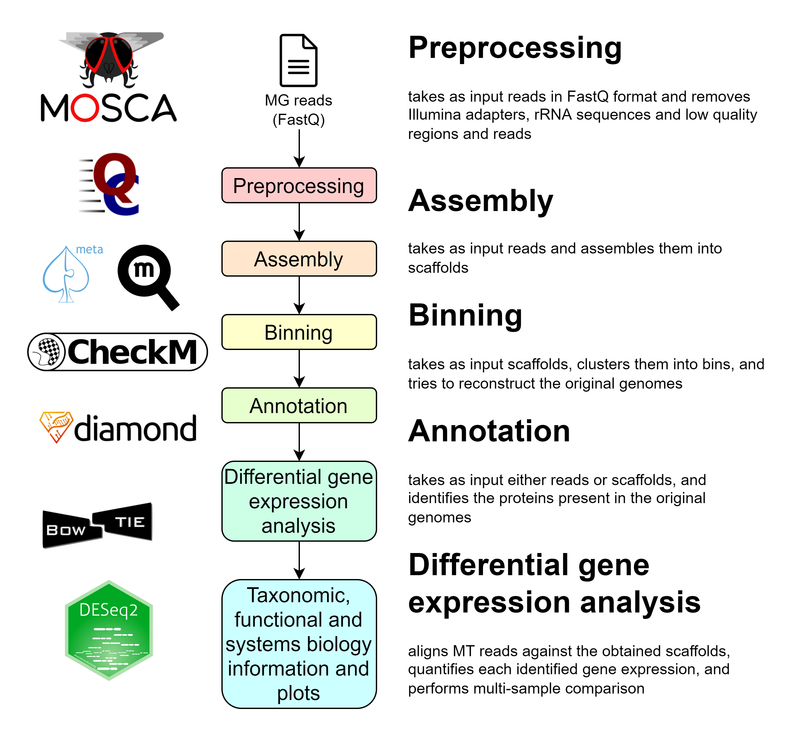

### Hi there! 👋

I was a PhD student, using bioinformatics to "Uncover the role of conductive nanomaterials in anaerobic digestion".

### Tools for meta-omics analyses

My work has mostly been the development of tools for analyses of meta-omics data, i.e., the study of the collective genomes, transcriptomes or proteomes of a microbial community.

These are the main tools I have developed for meta-omics analyses:

#### UPIMAPI, reCOGnizer and KEGGCharter

[UPIMAPI](https://github.com/iquasere/UPIMAPI), [reCOGnizer](https://github.com/iquasere/reCOGnizer) and [KEGGCharter](https://github.com/iquasere/KEGGCharter) are tools developed for the analyses of omics data, and optimized for handling the challenges of meta-omics.

<p align="center">
    
</p>

#### MOSCA

[MOSCA](https://github.com/iquasere/MOSCA) is a powerful pipeline developed for metagenomics (MG), metatranscriptomics (MT) and metaproteomics (MP) integrated analyses.

<p align="center">
    
</p>


#### Finally, some metrics about my coding routine:

<!--START_SECTION:waka-->


**I'm an Early 🐤** 

```text
🌞 Morning                1698 commits        ██████░░░░░░░░░░░░░░░░░░░   23.40 % 
🌆 Daytime                3827 commits        █████████████░░░░░░░░░░░░   52.74 % 
🌃 Evening                1370 commits        █████░░░░░░░░░░░░░░░░░░░░   18.88 % 
🌙 Night                  362 commits         █░░░░░░░░░░░░░░░░░░░░░░░░   04.99 % 
```
📅 **I'm Most Productive on Wednesday** 

```text
Monday                   1301 commits        ████░░░░░░░░░░░░░░░░░░░░░   17.93 % 
Tuesday                  1653 commits        ██████░░░░░░░░░░░░░░░░░░░   22.78 % 
Wednesday                1793 commits        ██████░░░░░░░░░░░░░░░░░░░   24.71 % 
Thursday                 1036 commits        ████░░░░░░░░░░░░░░░░░░░░░   14.28 % 
Friday                   982 commits         ███░░░░░░░░░░░░░░░░░░░░░░   13.53 % 
Saturday                 57 commits          ░░░░░░░░░░░░░░░░░░░░░░░░░   00.79 % 
Sunday                   435 commits         █░░░░░░░░░░░░░░░░░░░░░░░░   05.99 % 
```


📊 **This Week I Spent My Time On** 

```text
💬 Programming Languages: 
YAML                     2 hrs 14 mins       ██████████████░░░░░░░░░░░   57.57 % 
Markdown                 43 mins             █████░░░░░░░░░░░░░░░░░░░░   18.66 % 
Lua                      38 mins             ████░░░░░░░░░░░░░░░░░░░░░   16.35 % 
Jinja2                   7 mins              █░░░░░░░░░░░░░░░░░░░░░░░░   03.11 % 
HTML                     4 mins              ░░░░░░░░░░░░░░░░░░░░░░░░░   01.94 % 

🐱‍💻 Projects: 
ansible-puli             3 hrs 53 mins       █████████████████████████   100.00 % 
```

🤖 **AI Coding This Week** 

```text
No AI Coding Activity Tracked This Week
```

**I Mostly Code in Python** 

```text
Python                   13 repos            █████████░░░░░░░░░░░░░░░░   34.21 % 
HTML                     10 repos            ███████░░░░░░░░░░░░░░░░░░   26.32 % 
Java                     4 repos             ███░░░░░░░░░░░░░░░░░░░░░░   10.53 % 
Shell                    2 repos             █░░░░░░░░░░░░░░░░░░░░░░░░   05.26 % 
JavaScript               1 repo              █░░░░░░░░░░░░░░░░░░░░░░░░   02.63 % 
```


 Last Updated on 31/07/2026 20:16:35 UTC
<!--END_SECTION:waka-->
