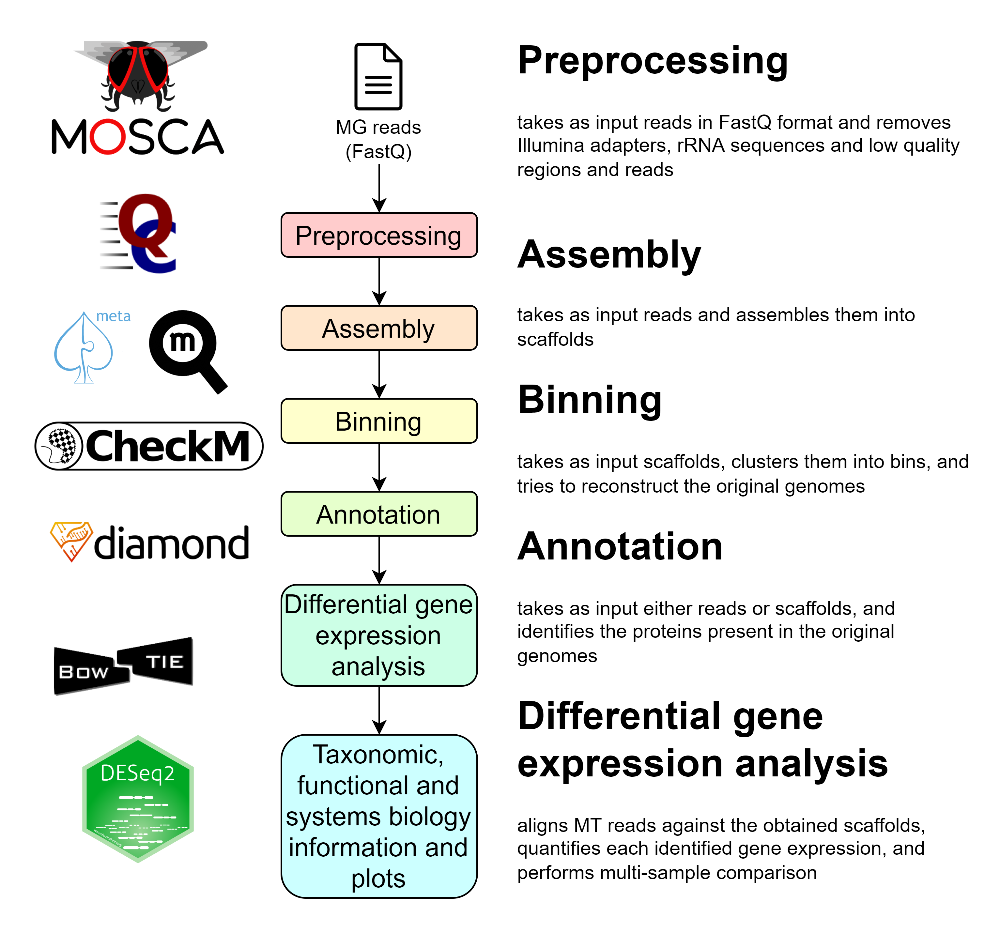

### Hi there! 👋

I was a PhD student, using bioinformatics to "Uncover the role of conductive nanomaterials in anaerobic digestion".

### Tools for meta-omics analyses

My work has mostly been the development of tools for analyses of meta-omics data, i.e., the study of the collective genomes, transcriptomes or proteomes of a microbial community.

These are the main tools I have developed for meta-omics analyses:

#### UPIMAPI, reCOGnizer and KEGGCharter

[UPIMAPI](https://github.com/iquasere/UPIMAPI), [reCOGnizer](https://github.com/iquasere/reCOGnizer) and [KEGGCharter](https://github.com/iquasere/KEGGCharter) are tools developed for the analyses of omics data, and optimized for handling the challenges of meta-omics.

<p align="center">
    
</p>

#### MOSCA

[MOSCA](https://github.com/iquasere/MOSCA) is a powerful pipeline developed for metagenomics (MG), metatranscriptomics (MT) and metaproteomics (MP) integrated analyses.

<p align="center">
    
</p>


#### Finally, some metrics about my coding routine:

<!--START_SECTION:waka-->


**I'm an Early 🐤** 

```text
🌞 Morning                1702 commits        ██████░░░░░░░░░░░░░░░░░░░   23.50 % 
🌆 Daytime                3826 commits        █████████████░░░░░░░░░░░░   52.83 % 
🌃 Evening                1358 commits        █████░░░░░░░░░░░░░░░░░░░░   18.75 % 
🌙 Night                  356 commits         █░░░░░░░░░░░░░░░░░░░░░░░░   04.92 % 
```
📅 **I'm Most Productive on Wednesday** 

```text
Monday                   1300 commits        ████░░░░░░░░░░░░░░░░░░░░░   17.95 % 
Tuesday                  1653 commits        ██████░░░░░░░░░░░░░░░░░░░   22.83 % 
Wednesday                1787 commits        ██████░░░░░░░░░░░░░░░░░░░   24.68 % 
Thursday                 1037 commits        ████░░░░░░░░░░░░░░░░░░░░░   14.32 % 
Friday                   979 commits         ███░░░░░░░░░░░░░░░░░░░░░░   13.52 % 
Saturday                 57 commits          ░░░░░░░░░░░░░░░░░░░░░░░░░   00.79 % 
Sunday                   429 commits         █░░░░░░░░░░░░░░░░░░░░░░░░   05.92 % 
```


📊 **This Week I Spent My Time On** 

```text
💬 Programming Languages: 
YAML                     8 hrs 10 mins       █████████████████████░░░░   85.30 % 
Markdown                 58 mins             ███░░░░░░░░░░░░░░░░░░░░░░   10.25 % 
Text                     13 mins             █░░░░░░░░░░░░░░░░░░░░░░░░   02.27 % 
XML                      5 mins              ░░░░░░░░░░░░░░░░░░░░░░░░░   00.91 % 
Jinja2                   3 mins              ░░░░░░░░░░░░░░░░░░░░░░░░░   00.58 % 

🐱‍💻 Projects: 
ansible-puli             9 hrs 21 mins       ████████████████████████░   97.51 % 
Unknown Project          14 mins             █░░░░░░░░░░░░░░░░░░░░░░░░   02.49 % 
```

🤖 **AI Coding This Week** 

```text
No AI Coding Activity Tracked This Week
```

**I Mostly Code in Python** 

```text
Python                   13 repos            █████████░░░░░░░░░░░░░░░░   34.21 % 
HTML                     10 repos            ███████░░░░░░░░░░░░░░░░░░   26.32 % 
Java                     4 repos             ███░░░░░░░░░░░░░░░░░░░░░░   10.53 % 
Shell                    2 repos             █░░░░░░░░░░░░░░░░░░░░░░░░   05.26 % 
JavaScript               1 repo              █░░░░░░░░░░░░░░░░░░░░░░░░   02.63 % 
```


 Last Updated on 28/09/2026 23:43:12 UTC
<!--END_SECTION:waka-->
